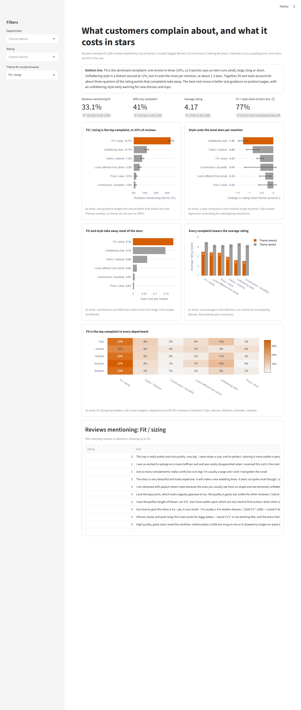
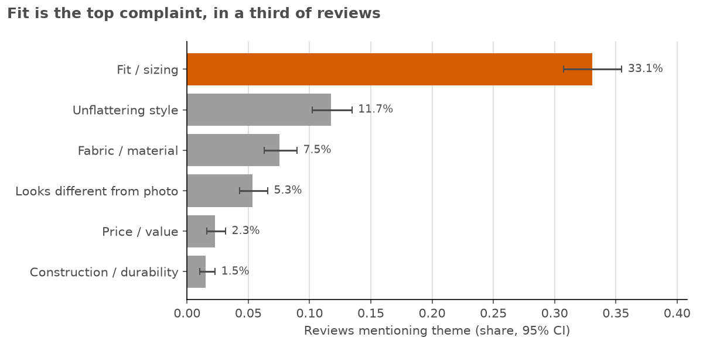
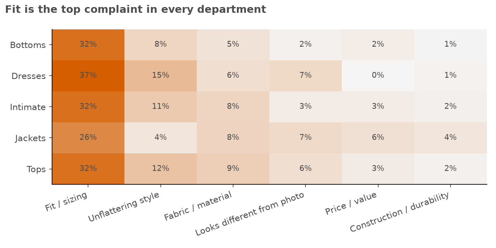
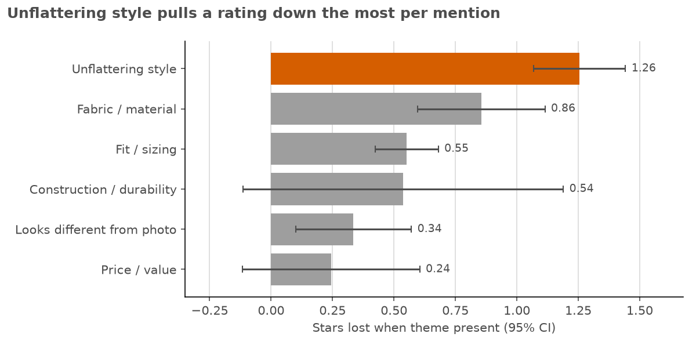
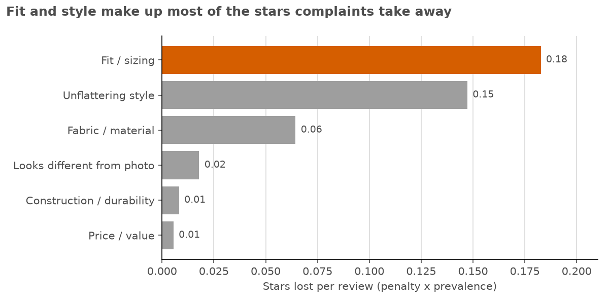

# Review Insights AI

**Question:** What are customers complaining about most, and how much does each complaint theme cost in lower star ratings?

**Data:** The Kaggle dataset [Women's E-Commerce Clothing Reviews](https://www.kaggle.com/datasets/nicapotato/womens-ecommerce-clothing-reviews) (CC0), with 23,486 reviews and 22,634 after cleaning. Each review has free text, a 1–5 star rating and a department.

**How the AI part works:** A local LLM (**llama3.2 via Ollama**, running on a laptop CPU) read a **random sample of 1,500 reviews, not all 22,634**. For each review it labeled six complaint themes and the overall tone. Every estimate below is a sample estimate with a margin of error. To check the model, 100 random reviews from the sample were labeled independently as a reference and compared with the model's labels.

## Dashboard preview



Run it with `streamlit run app.py`.

---

## 1. Bottom line

**Fit is the dominant complaint: one review in three (33%, ±2.4 points) says an item runs small, large, long or short.** Unflattering style is a distant second at 12%, but it costs the most per mention, at about 1.3 stars. Together, fit and style account for about three-quarters of the rating points that complaints take away. The best next move is better size guidance on product pages, with an unflattering-style early warning for new dresses and tops.

## 2. Key findings

1. **41% of reviews contain at least one complaint, even though 56% of reviews are 5 stars.** Customers often complain and still rate highly. Complaint rates therefore say more about where the product falls short than star averages do.
2. **Fit and sizing complaints are about three times more common than any other theme.** In the sample, 33.1% of reviews mention fit (95% CI 30.7–35.5%). That compares with unflattering style at 11.7% (10.2–13.5%), fabric and material at 7.5% (6.3–9.0%), and "looks different from the photo" at 5.3% (4.3–6.6%). Price (2.3%) and construction (1.5%) are rare. Fit is the top complaint in every department, from 26% of jacket reviews to 37% of dress reviews.





3. **Unflattering style is linked to the biggest rating drop per mention, and fit to the biggest drop in total.** A regression controls for reviews that raise several complaints at once. Holding the other complaints constant, an unflattering-style complaint goes with 1.26 fewer stars, a fabric complaint with 0.86 fewer, fit with 0.55 fewer and photo mismatch with 0.34 fewer. Price and construction effects are not statistically distinguishable from zero. Multiplying each penalty by how often the complaint appears, fit costs 0.18 stars per average review and style 0.15. Those two make up 77% of the roughly 0.43 stars that complaints take off the average rating.





4. **The model agrees moderately to well on the big themes but undercounts construction complaints.** On the 100 reference reviews, theme-level agreement ranges from 83% (fit) to 99% (price). Cohen's kappa is 0.81 for style, 0.67 for fabric and 0.59 for both fit and photo. Tone agreement is 93% (kappa 0.86). All six theme labels match exactly on 67 of 100 reviews. The weak spot is construction and durability: the model caught 1 of the 6 the reference found (recall 17%, kappa 0.27). The 1.5% construction rate is therefore an undercount and should not be read as "construction is not a problem."
5. **The results are not a department-mix artifact, and the sample is representative.** Adding department to the regression moves no coefficient by more than 0.03 stars, so no Simpson's paradox appears. The sample's rating and department mix are within 0.9 points of the full 22,634 reviews on every category.

## 3. Recommendations (ranked by impact vs. effort)

| # | Action | Owner | Expected impact (assumptions) | How to measure |
|---|---|---|---|---|
| 1 | **Size guidance on every product page.** Show a "runs small / true / large" signal taken from that item's reviews, plus model measurements, and offer a size recommendation at checkout. | E-commerce Product Manager, with Merchandising | **+0.04 to +0.07 stars on the average rating**, if the guidance removes 20–40% of fit complaints. Fit costs 0.18 stars per review today. Fit-related returns should also fall, though return data was not available here. Medium effort. | Share of reviews that flag fit (33% today) on items with guidance vs a holdout; fit-reason return rate |
| 2 | **Unflattering-style early warning for new dresses and tops.** Flag any item whose style-complaint rate in its first 2–4 weeks of reviews runs well above the 12% average, and review its photos or reorder depth. | Buying / Design lead | **+0.03 to +0.06 stars**, if 20–40% of style complaints are avoided. Style costs 0.15 stars per review, and 44% of style-complaint reviews are 1–2 stars. Low to medium effort, because the labeling pipeline already exists. | Style-complaint rate by item and cohort; markdown and return rates on flagged items |
| 3 | **State sheerness, lining and fabric weight in product descriptions**, and add a thin or see-through check to supplier QA. | Sourcing / QA Manager | **+0.01 to +0.03 stars**, if 20–40% of fabric complaints are avoided. Fabric costs 0.06 stars per review. Low effort for the descriptions. | Fabric-complaint rate (7.5% today) before vs after the description change |

The star gains are small because the average is already 4.2 and most reviews are positive. The practical value is fewer 1–2 star reviews on the items that drive them, plus fewer returns.

## 4. Method and rigor

- **Pipeline:**
  1. `clean.py` writes `data/clean/reviews.parquet` and [DATA_QUALITY.md](DATA_QUALITY.md). It drops 845 reviews with no text and 7 exact duplicates, and fills 13 missing departments with "Unknown".
  2. `classify.py` runs the LLM labeling and writes `data/clean/labels.parquet`.
  3. `analyze.py` runs `sql/01`–`05` in DuckDB plus the regression and writes `outputs/*.csv`.
  4. `app.py` is the Streamlit dashboard.

  Every result figure above comes from a file in `outputs/` or simple arithmetic on one. Process notes, such as throughput, come from the build log.
- **Sampling:** 1,500 reviews were drawn uniformly at random (`random_state=42`) from the 22,634 clean reviews. Margins of error are 95% Wilson intervals. The finite-population correction is negligible because the sample is 6.6% of the population (it shrinks intervals by about 3%), so it is not applied.
- **LLM labeling:**
  - **Prompt:** each review goes to llama3.2 with a fixed prompt that defines the six themes (`classify.py`, `THEMES`). Ollama's JSON-schema output forces a true/false answer for every theme and a tone of positive, negative or mixed, at temperature 0.
  - **Batching:** requests run in batches of 4 concurrent calls, which roughly doubled throughput on this CPU-only machine. Putting several reviews into one prompt was tested and rejected: the model returned empty or incomplete lists and missed obvious fit complaints.
  - **Caching:** results are saved to `data/llm_cache.jsonl` after every review, so a rerun only labels reviews that are not cached yet. The interrupted run resumed this way.
  - **Fallback:** if Ollama is not reachable, a keyword fallback labels the sample and tags each row `method = 'keyword'`. It was **not needed**: all 1,500 rows are `method = 'llm'`.
- **Accuracy check:** 100 reviews were drawn at random from the sample (`random_state=7`). The reference labeler is **Claude, the AI assistant that built this repo, not a human annotator.** Claude read each review and labeled it with the same theme definitions, without seeing the model's labels (`data/reference_labels.csv`). `sql/05_llm_vs_reference.sql` reports agreement, precision, recall and Cohen's kappa per theme.
- **Rating cost:** an OLS regression of star rating on the six complaint flags, with HC3 robust errors (`outputs/rating_model.csv`). A second version adds department fixed effects as a Simpson's paradox check. "Stars lost per review" = coefficient × prevalence.

## 5. Limitations and risks

- **Association, not causation.** Review text and star rating are written together, so a complaint and a low rating are two expressions of the same disappointment. The coefficients show how much lower complaining reviews rate, not how much a fix would raise ratings. Treat the impact ranges as optimistic.
- **The reference labels are not human ground truth.** A second AI model wrote them. Agreement measures consistency between two readers, not accuracy against a human panel. A human-labeled set would raise confidence.
- **Small model, small check.** llama3.2 is a 3B-parameter model. With 100 reference reviews, rare themes rest on very few positives (6 construction, 2 price), so their kappas are unstable.
- **Construction is undercounted** (recall 17% on the reference set). Its prevalence and star cost are not reliable.
- **Survivorship and selection.** Only customers who chose to write a review appear here. Customers who returned items silently, or never bought, are missing.
- **No business outcome data.** The dataset has no returns, revenue or item-level sales, so impact is expressed in stars, not dollars.

## 6. Next steps

1. Have a person label 200–300 reviews, with emphasis on construction and price, to measure true accuracy and recalibrate theme rates.
2. Rerun the pipeline monthly on new reviews to track whether fit and style complaint rates move after recommendations 1 and 2.
3. Join return reasons and item sales, so complaint themes can be priced in dollars, not stars.
4. Try a larger local model (8B) on the reference set and keep it if construction recall improves.

---

## Run it

```bash
python -m venv .venv && .venv/Scripts/activate        # Windows; use .venv/bin/activate on macOS/Linux
pip install -r requirements.txt
# Raw data (not committed; needs a Kaggle API token in ~/.kaggle/kaggle.json):
python -m kaggle datasets download nicapotato/womens-ecommerce-clothing-reviews -p data/raw --unzip
python clean.py       # -> data/clean/reviews.parquet, DATA_QUALITY.md
python classify.py    # needs Ollama running with llama3.2 (ollama pull llama3.2); uses the committed cache, so nothing is re-sent
python analyze.py     # -> outputs/*.csv
streamlit run app.py
```

The cleaned data, the LLM label cache and the labels parquet file are all committed. The dashboard and `analyze.py` run straight after cloning, without Ollama or Kaggle.

**Dashboard:** a bottom-line box, a KPI row plus five charts: complaint prevalence with 95% intervals; star penalty per theme; stars lost per review; average rating with vs without each theme; and theme rate by department. A review browser shows matching reviews. Filters cover department, rating and theme.

| Path | What it is |
|---|---|
| `clean.py` | Cleaning and data-quality log |
| `classify.py` | Sampling, LLM labeling with cache, keyword fallback |
| `sql/01`–`05_*.sql` | Theme rates, rating gaps, department mix, sample check, LLM vs reference |
| `analyze.py` | Runs the queries and the rating regression |
| `app.py` | Streamlit dashboard |
| `make_figures.py`, `screenshot.py` | README figures and dashboard screenshot (`assets/`) |
| `data/reference_labels.csv` | The 100 reference labels |
| `outputs/` | Results behind every number above |

## License

Code: MIT (see `LICENSE`). Data: Women's E-Commerce Clothing Reviews, CC0 (public domain), from Kaggle user nicapotato.
